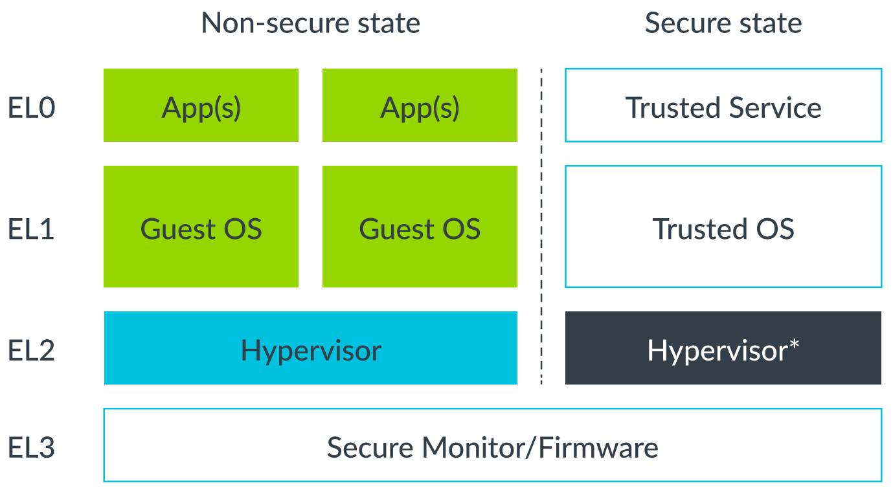

# Hypervisor

We will introduce some introductory hypervisor and virtualization theory. Hypervisor is a piece of software that is responsible for creating, managing, and scheduling of Virtual Machines (VMs).

The OS runs on the physical (host) machine is called Host OS, and the OS runs on a VM is called Guest OS.

## Types

Hypervisors can be divided into two broad categories: standalone, or Type 1, hypervisors and hosted, or Type 2.

Type 1 hypervisor runs directly on the HW and has full control of the hardware platform and all its resources, including CPU and physical memory. Examples are ACRN, Xen, and KVM/QEMU.

In a Type 2 hypervisor configuration, the Host OS has full control of the hardware platform and all its resources, including CPU and physical memory. Type 2 hypervisor runs as a normal application on top of the Host OS. Examples are VirtualBox and QEMU.

## Full and para-virtualization

Full system virtualization emulates a real physical machine. Paravirtualization, in which core parts of the Guest OS are modified to operate on a virtual hardware platform instead of a physical machine. This modification is undertaken to improve performance. Usually, I/O devices are virtualized using paravirtualization techniques. Example of such paravirtualized I/O devices is VirtIO.

# Virtualization in ARMv8-A

The Exception Levels (ELs) in Non-Secure and Secure states are shown in the following figure:

Hypervisor running at EL2 has access to several controls for virtualization:

- Stage 2 translation
- EL1/0 instruction and register access trapping
- Virtual exception generation
- Context switching

# Goals

In this project, a realistic goal is a minimal bare-metal hypervisor that:

- boots at EL2
- initializes virtualization
- creates one guest VM (Linux or bare-metal)
- traps selected exceptions
- handles guest context switching
- supports UART virtualization
- supports timer virtualization

Some future features later in mind:

- multiple VMs
- GIC virtualization
- Device passthrough
- VirtIO
